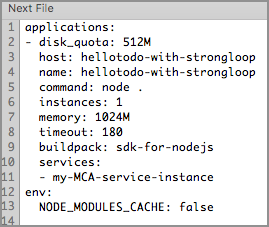

# HelloTodo 

## Overview
HelloTodo is a simple todo list application created with [StrongLoop](https://strongloop.com/), [LoopBack](https://strongloop.com/node-js/loopback-framework/) and [Bluemix Mobile Services](http://www.ibm.com/cloud-computing/bluemix/solutions/mobilefirst/). It serves as a sample app demonstrating how to use the above technologies in order to create a mobile backend, enable authentication and collect monitoring data. 

### Table of content
* Overview
* Creating this application
* Deploying HelloTodo application to Bluemix
* Using a MobileFirst Services Boilerplate
* Manually deploying to Bluemix
	* Getting setup with Bluemix
	* Creating an instance of Mobile Client Access service
	* Cloning and deploying HelloTodo app
* Using the HelloTodo application and API

## Creating this application 

Below video demonstrates how the HelloTodo application was created. It might be instrumental in understanding how does StrongLoop, LoopBack and Mobile Client Access work. If you're just interested in running the app in Bluemix you may skip this video. 

<a href="https://www.youtube.com/watch?v=fAM0wOfvelY" target="_blank">

</a>


## Deploying HelloTodo application to Bluemix

There are two ways of running this application - using a MobileFirst Services Boilerplate on Bluemix or cloning the repository and deploying to Bluemix manually. 

## Using a MobileFirst Services Boilerplate
Start by creating a mobile backend on Bluemix by using the MobileFirst Services Boilerplate

> The links in below steps lead to the US_SOUTH Bluemix region. You might want to pick a region closer to you, e.g. UK or SYDNEY. 

1. [Log in](https://console.ng.bluemix.net/home/auth/bluemix) into your IBM Bluemix account
2. Open Bluemix Catalog [https://console.ng.bluemix.net/catalog/](https://console.ng.bluemix.net/catalog/)
3. Find and select the [MobileFirst Services Starter](https://console.ng.bluemix.net/catalog/starters/mobilefirst-services-starter/) under the Boilerplates section
4. Select the space you want to add your mobile backend to
5. Enter the name and a host for your mobile backend. 
6. Optionally you can change service plans
7. Click CREATE button

As a result of the above steps Bluemix will provision a Node.JS runtime and populate it with a HelloTodo application created using StrongLoop. This application uses LoopBack framework to expose the `/api/Items` API which will be used by Web UI. This reposotory contains the source code of that HelloTodo application.

> Some of the methods of the above API are protected by Mobile Client Access service, therefore they will be unaccessible from web UI. You will need to use mobile HelloTodo samples to be able to access these APIs. This will be explained later.

Usually it might take couple of minutes for your application to be provisioned and started. Once you're back to your Bluemix Application Dashboard click on an application route found in the top part of a screen. 

Once you open the web interface of a HelloTodo app you may continue to the `Using the HelloTodo application` and API section of this tutorial below

## Manually deploying to Bluemix
To manually deploy this application to Bluemix perform the following steps

### Getting setup with Bluemix

1. Make sure you have [IBM Bluemix](https://console.ng.bluemix.net/) account
2. Make sure you have [Cloud Foundry CLI](https://www.ng.bluemix.net/docs/cli/downloads.html) tool installed
3. Open terminal and 	verify that cf tool is available by running `cf --version`
1. Setup `cf` tool to work with a Bluemix API server of your choice, for instance `cf api https://api.ng.bluemix.net`

	> Use following URLs for other Bluemix regions:
	
	> US-SOUTH `https://api.ng.bluemix.net`
	
	> UNITED KINGDOM `https://api.en-gb.bluemix.net`
	
	> SYDNEY `https://api.au-syd.bluemix.net`

1. Login with your Bluemix credentials and pick your organization and space by running `cf login`

1. Make sure you're in a right region, organization and space by running `cf target`	
### Creating an instance of Mobile Client Access service

1. HelloTodo app requires an instance of a Mobile Client Access service to be bound. Mobile Client Access is a service that provides authentication and monitoring capabilities for your Bluemix apps. 

1. Run the following command to create a new instance of Mobile Client Access service if your space. 

	```Shell
	cf create-service AdvancedMobileAccess Bronze my-MCA-service-instance
	```
	
	> You can pick any other name instead of my-MCA-service-instane
	
1. Run `cf services` command and validate a new service instance was added

### Cloning and deploying HelloTodo app

1. Clone this repository to your local disk

	```Shell
	git clone https://github.com/ibm-bluemix-mobile-services/bms-hellotodo-strongloop
	```
	
1. Edit `manifest.yml` file. Change the `host` property to some unique value. There might be other applications deployed to Bluemix with `hellotodo-with-strongloop` host. If do not change it your deployment might fail. 

1. Edit `manifest.yml` file and add the services section. Add the Mobile Client Access service instance name created in previous steps. Final result should look like this

	 

1. Use `cf push` command to deploy your application to Bluemix, bind it to Mobile Client Access service instance and start it. 

1. Once deployment completes successfully use `cf apps` command to see the list of available applications and their routes

1. Your Bluemix application should be available at `https//{hostname-from-manifest.yml}.mybluemix.net`

## Using the HelloTodo application and API
You will see a HelloTodo web app. Start by following the guided experience steps described in the web UI. Eventually you will try to DELETE a todo item and will discover that this action can only be complete when using the HelloTodo mobile apps samples. This is due to a fact that the mobile backend is by default protected by a Mobile Client Access - a Bluemix service that provides security and monitoring functionality for mobile backends. 

> You might also want to hit the "View API Reference" button on web UI to see the API specs.

Continue experiencing Bluemix Mobile Services by using one of the following sample applications.

* [HelloTodo for iOS](https://github.com/ibm-bluemix-mobile-services/bms-samples-ios-hellotodo)
* [HelloTodo for Android](https://github.com/ibm-bluemix-mobile-services/bms-samples-android-hellotodo) 
