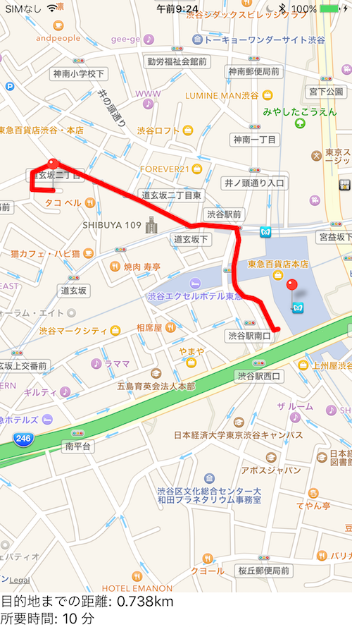

# MKDirectionsDemo

**MKDirections** を使用して、出発地から目的地までのルート、距離、所要時間を表示するアプリ

## 概要

- マッピューに出発点（渋谷駅）から目的地（ドンキホーテ渋谷店）までのルートを一つだけ表示する（最初の1つ）
- ラベルに、距離と所要時間を表示する
- 出発点と目的地にはピンを立て、適当な注釈をつける
- ルート検索条件として、徒歩を指定する

## 動作確認環境

- OS X EI Capitan 10.11.3
- Xcode Version 7.2.1 (7C1002)

## 関連情報

- [MKDirections Class Reference](https://developer.apple.com/library/ios/documentation/MapKit/Reference/MKDirections_class/)
